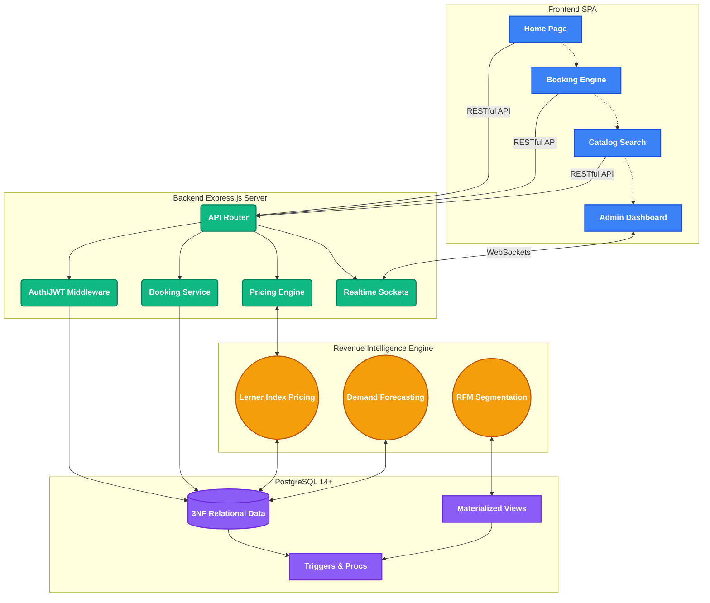

<p align="center">
  
</p>

<h1 align="center">StageAlpha</h1>
<p align="center">
  <strong>Algorithmic Revenue Intelligence Engine for Event Equipment Logistics</strong>
</p>

<p align="center">
  
  
  
  
  
  
</p>

---

## 📋 Overview

StageAlpha is a **professional-grade logistics operations platform** and **revenue-optimization framework** for managing event equipment rental lifecycles. Built on top of a fully normalized 3NF PostgreSQL architecture, it features a custom-built **Lerner Index pricing engine** that dynamically optimizes rental prices using OLS-estimated price elasticity, seasonal multipliers, and historical demand patterns.

### Key Differentiators

| Feature | Implementation |
|---------|---------------|
| **Dynamic Pricing** | Lerner Index formula with OLS elasticity estimation |
| **Revenue Backtesting** | Historical simulation proving algorithm revenue uplift |
| **RFM Segmentation** | 5-tier customer segmentation (Champion → Lost) |
| **RPAED Analysis** | Revenue-Per-Available-Equipment-Day metric |
| **Real-Time Telemetry** | WebSocket-powered IoT simulation dashboard |
| **Full DBMS Layer** | 23 tables, 5 triggers, 4 stored procedures, 6 views, 2 materialized views |

---

## 🏗️ Architecture



---

## 🚀 Quick Start

### Prerequisites
- **Node.js** 18+
- **PostgreSQL** 14+
- **Redis** (optional — app runs without it)

### Setup

```bash
# 1. Clone and install
git clone <repository-url>
cd stageAlpha
npm install

# 2. Configure environment
cp .env.example .env
# Edit .env with your PostgreSQL credentials

# 3. Initialize database
npm run db:init    # Creates all 23 tables, triggers, views
npm run db:seed    # Loads sample data

# 4. Start server
npm run dev        # Development (with hot-reload)
npm start          # Production
```

### Default Admin Credentials
```
Email:    admin@stagealpha.com
Password: Admin@123
```

---

## 📡 API Reference

All API endpoints follow the format: `GET/POST/PUT/PATCH/DELETE /api/v1/<resource>`

| Module | Routes | Auth Required | Description |
|--------|--------|:---:|-------------|
| **Auth** | `/auth/register`, `/auth/login`, `/auth/refresh`, `/auth/google` | ❌/✅ | JWT-based authentication with refresh tokens |
| **Equipment** | `/equipment`, `/equipment/:id`, `/equipment/search` | ❌ | Full-text search, price history, reviews |
| **Bookings** | `/bookings`, `/bookings/:id/status`, `/bookings/:id/invoice` | ✅ | Transactional booking with stock locking |
| **Analytics** | `/analytics/dashboard`, `/analytics/revenue`, `/analytics/reports/*` | ✅🔒 | Admin-only BI dashboards |
| **Intelligence** | `/intelligence/rpaed`, `/intelligence/roi`, `/intelligence/rfm` | ✅🔒 | Revenue intelligence engine |
| **Pricing** | `/pricing/estimate/:id`, `/pricing/update-all` | ✅🔒 | Dynamic pricing & batch updates |
| **Backtest** | `/backtest/run`, `/backtest/results` | ✅🔒 | Historical revenue simulation |
| **Packages** | `/packages`, `/packages/:slug` | ❌ | Pre-built equipment bundles |
| **Quotes** | `/quotes`, `/quotes/:id/accept`, `/quotes/:id/approve` | ✅ | Quote-to-booking conversion pipeline |
| **Customers** | `/customers`, `/customers/:id` | ✅🔒 | Customer management with RFM segments |
| **Staff** | `/staff`, `/staff/assign`, `/staff/available` | ✅🔒 | Staff scheduling & assignments |
| **Notifications** | `/notifications`, `/notifications/mark-all-read` | ✅ | Real-time notification system |
| **Health** | `/health` | ❌ | System health with DB connectivity check |

> 🔒 = Admin role required

---

## 🧮 Pricing Engine (Lerner Index)

The core algorithmic pricing uses the **Lerner Index** from microeconomics:

```
P* = MC × (|ε| / (|ε| - 1)) × S
```

Where:
- **P\*** = Optimal price
- **MC** = Marginal cost (40% of base price for rental operations)
- **ε** = Price elasticity of demand (estimated via OLS regression: `REGR_SLOPE`)
- **S** = Seasonal multiplier (1.25 peak / 1.0 regular / 0.85 off-season)

The elasticity is dynamically estimated from historical booking data using PostgreSQL's built-in `REGR_SLOPE` and `REGR_R2` aggregate functions.

---

## 🗃️ Database Architecture

### Layer Structure
1. **Layer 1** — Independent tables: `categories`, `venues`, `customers`, `staff`
2. **Layer 2** — Equipment with category FK
3. **Layer 3** — Transactional: `bookings`, `booking_items`, `payments`, `reviews`
4. **Layer 4** — Quantitative: `pricing_rules`, `price_history`, `elasticity_estimates`, `demand_forecasts`
5. **Layer 5** — Analytics: `backtest_results`, `revenue_snapshots`, `audit_log`
6. **Layer 6** — Extensions: `packages`, `quotes`, `notifications`, `staff_assignments`

### Key Database Features
- **5 Triggers**: Auto-timestamp, stock management, audit logging, booking totals, availability check
- **4 Stored Procedures**: Elasticity estimation (OLS), optimal pricing (Lerner), backtesting, batch updates
- **Generated Columns**: `price_history.change_pct`, `elasticity_estimates.confidence_level`, `backtest_results.improvement_pct`
- **Full-Text Search**: Weighted `tsvector` on equipment (A: name, B: description) with GIN index
- **Materialized Views**: `mv_revenue_daily`, `mv_revenue_monthly` with unique indexes

---

## 🔐 Security

- **JWT Authentication** with separate access (15m) and refresh (7d) tokens
- **Refresh token rotation** via httpOnly secure cookies
- **Password hashing** with bcrypt (configurable rounds)
- **Rate limiting**: 100/min general, 5/15min login, 3/hr registration
- **Helmet** security headers
- **CORS** with configurable origins
- **Input validation** via express-validator with sanitization
- **Constant-time** password comparison to prevent timing attacks
- **Row-level security** — users can only access their own bookings
- **Soft deletes** for referential integrity on equipment

---

## 📊 Real-Time Features

- **WebSocket** (Socket.IO) for live dashboard updates
- **IoT Telemetry Simulator** — decibel, temperature, voltage monitoring
- **Inventory alerts** — real-time stock change notifications
- **Booking notifications** — instant admin alerts on new/updated bookings
- **Admin dashboard** — auto-refreshing stats every 3 seconds

---

## 📁 Project Structure

```
stageAlpha/
├── config/          # App, DB, Redis configuration
├── db/              # SQL: schema, seeds, triggers, views, procedures
├── middleware/       # Auth, cache, error handler, rate limiter, validation
├── routes/          # 15 RESTful route modules
├── services/        # BacktestEngine, Socket.IO, Elasticity estimator
├── public/          # SPA frontend (HTML, CSS, JS)
│   ├── css/         # Design system (variables, base, components, pages)
│   ├── js/          # Frontend controllers and services
│   └── views/       # 32 HTML view templates
├── server.js        # Express app entry point
└── package.json     # Dependencies and scripts
```

---

## 🎓 Academic Context

**NMIMS MPSTME | Academic Year 2025-26**  
- Web Programming: 702AI0C028  
- Database Management Systems: 702A10C027

---

*Built with precision. Optimized for revenue. Designed for scale.*
